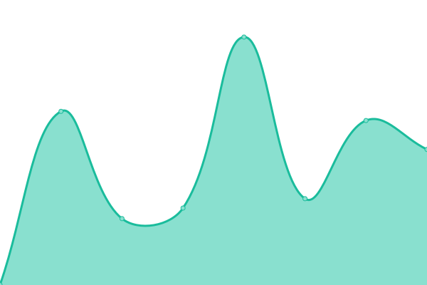
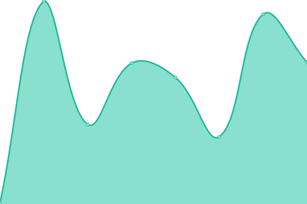

# [📈 Live Status](https://Milwaukee-Bucks.github.io/uptime-monitor): <!--live status--> **🟩 All systems operational**

This repository contains the open-source uptime monitor and status page for [The Milwaukee Bucks](https://www.nba.com/bucks), powered by [Upptime](https://github.com/upptime/upptime).

With [Upptime](https://upptime.js.org), you can get your own unlimited and free uptime monitor and status page, powered entirely by a GitHub repository. We use [Issues](https://github.com/Milwaukee-Bucks/uptime-monitor/issues) as incident reports, [Actions](https://github.com/Milwaukee-Bucks/uptime-monitor/actions) as uptime monitors, and [Pages](https://Milwaukee-Bucks.github.io/uptime-monitor) for the status page.

<!--start: status pages-->
<!-- This summary is generated by Upptime (https://github.com/upptime/upptime) -->
<!-- Do not edit this manually, your changes will be overwritten -->
<!-- prettier-ignore -->
| URL | Status | History | Response Time | Uptime |
| --- | ------ | ------- | ------------- | ------ |
|  [Milwaukee Bucks Main Website](https://www.nba.com/bucks) | 🟩 Up | [milwaukee-bucks-main-website.yml](https://github.com/Milwaukee-Bucks/uptime-monitor/commits/HEAD/history/milwaukee-bucks-main-website.yml) | 

 699ms
     
 | 

<a href="https://Milwaukee-Bucks.github.io/uptime-monitor/history/milwaukee-bucks-main-website">100.00%</a>
    

|  [bucks.com Redirect](https://bucks.com) | 🟩 Up | [bucks-com-redirect.yml](https://github.com/Milwaukee-Bucks/uptime-monitor/commits/HEAD/history/bucks-com-redirect.yml) | 

 420ms
     
 | 

<a href="https://Milwaukee-Bucks.github.io/uptime-monitor/history/bucks-com-redirect">99.82%</a>
    

|  [Deer District](https://deerdistrict.com) | 🟩 Up | [deer-district.yml](https://github.com/Milwaukee-Bucks/uptime-monitor/commits/HEAD/history/deer-district.yml) | 

 140ms
     
 | 

<a href="https://Milwaukee-Bucks.github.io/uptime-monitor/history/deer-district">100.00%</a>
    

|  [The MECCA](https://themeccamke.com) | 🟩 Up | [the-mecca.yml](https://github.com/Milwaukee-Bucks/uptime-monitor/commits/HEAD/history/the-mecca.yml) | 

 456ms
     
 | 

<a href="https://Milwaukee-Bucks.github.io/uptime-monitor/history/the-mecca">100.00%</a>
    

<!--end: status pages-->

[**Visit our status website →**](https://Milwaukee-Bucks.github.io/uptime-monitor)

## 📄 License

- Powered by: [Upptime](https://github.com/upptime/upptime)
- Code: [MIT](./LICENSE) © [The Milwaukee Bucks](https://www.nba.com/bucks)
- Data in the `./history` directory: [Open Database License](https://opendatacommons.org/licenses/odbl/1-0/)
